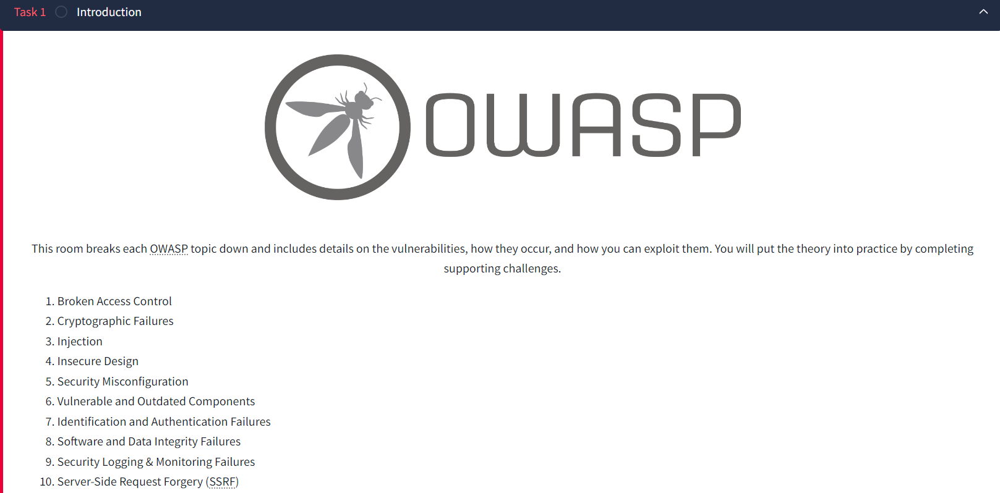

# Owasp top 10 (2021)

**Date**: 28, August, 2024  
**Author**: P.Hima Bindu  

---

[Click Here](https://tryhackme.com/r/room/owasptop102021) to go to the TryHackMe room.

---

Deploy the machine and go to [http://MACHINE_IP](http://MACHINE_IP) - Login with the username **noot** and the password **test1234**.

## **Task 4 :** Broken Access Control (IDOR Challenge)

- Look at other users' notes. What is the flag?
  - Try to change the 'note_id=1' parameter to something else. I tried 'note_id=2/3/4', At 'note_id=5' I get a hint displayed in the screen.
  - **Hint** - Do note_ids start from 1? Maybe go lower ;)
  - Then changed the 'note_id=0', Boom! I got the flag
  - **flag{fivefourthree}**
